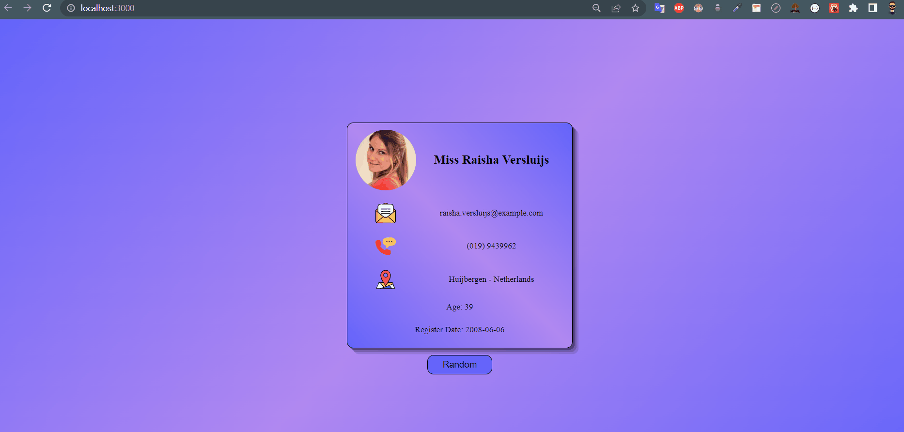

## Check The Live Website ➡️ [Live Website](https://osmankoyuncuu.github.io/react-random-user/)

## Animation of the Website

## Description

Project aims to create a random user.

## Project Skeleton

    react-task-tracker
    |
    ├── public
    │     └── index.html
    │     └── favicon.ico
    ├── src
    │    ├── assets
    │    │       ├── email.svg
    │    │       ├── loading.gif
    │    │       ├── location.svg
    │    │       └── phone.svg
    │    ├── components
    │    │       ├── Button
    │    │       │     ├── Button.css
    │    │       │     └── Button.jsx
    │    │       ├── Loading
    │    │       │     ├── Loading.css
    │    │       │     └── Loading.jsx
    │    │       └── User
    │    │             ├── User.css
    │    │             └── User.jsx
    │    ├── App.css
    │    ├── App.js
    │    ├── index.css
    │    └── index.js
    ├── .gitignore
    ├── package.json
    ├── random-user.gif
    ├── README.md
    └── yarn.lock

## Overview

I mastered HTML, CSS and React features in this project. You can see the visual representation of the website above.
